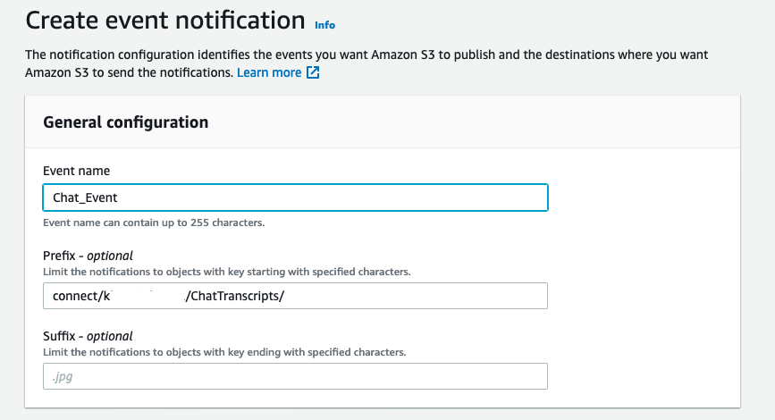
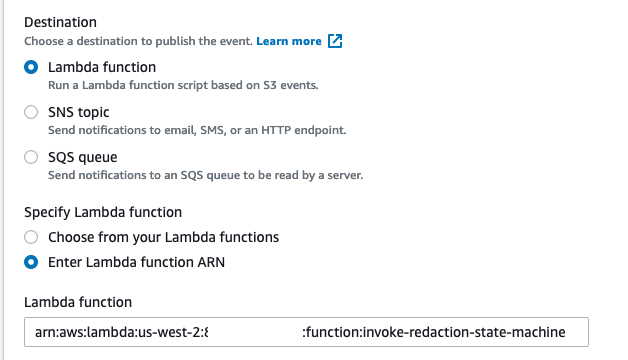
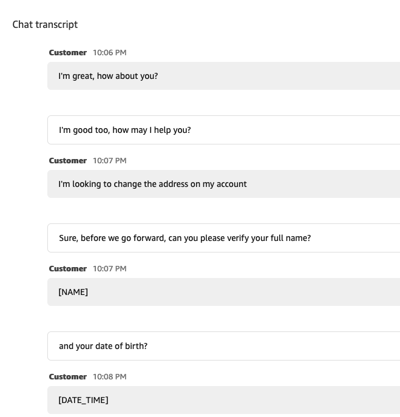
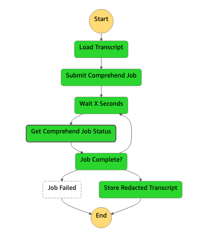

# Amazon Connect Chat Sensitive Data Redaction

## Overview

Amazon Connect is an omnichannel, cloud-based contact center service provided by AWS. Amazon Connect provides users with the ability to record chat conversations. When a chat conversation is recorded, the chat transcript is put into an S3 file. Oftentimes customers need to review transcripts to ensure that best practices are being followed and to understand the customer interactions. However, when customers review the transcripts, they typically should not see [sensitive information](https://docs.aws.amazon.com/comprehend/latest/dg/how-pii.html) in the transcript. Amazon Connect provides [Contact Lens](https://docs.aws.amazon.com/connect/latest/adminguide/sensitive-data-redaction.html) for contacts on the voice channel, which has the ability to remove such sensitive data, but Contact Lens is not currently available on the chat channel. This solution provides users with a way to remove sensitive data from their chat transcripts so that managers and supervisors can review past conversations without being exposed to any sensitive data.

## Architecture

When a chat transcript is put into the S3 bucket, it triggers a Lambda function(_Note: You need to set up this trigger on your own_). This Lambda function invokes an AWS Step Functions state machine which performs the redaction process. The state machine loads the transcript content, and passes it to Amazon Comprehend to detect any sensitive data. If there is any data detected by Comprehend, the data is replaced by the type of sensitive data in the transcript (for eg. [SSN]). The state machine creates a back up of your unredacted transcript file (with *.backup extension), and replaces the main chat transcript to redact any sensitive data. For example, if the customer said "My name is John Doe", the new transcript will read "My name is [NAME]".

## Installation Instructions

### Pre-requisites

1. An AWS Account.
1. An IAM user with the ability to create a serverless SAM application, create an IAM role, edit an Amazon Connect instance, and modify an S3 bucket's configuration.
1. An Amazon Connect instance with a chat contact flow set up.

### Steps

1. Go to the Amazon Connect console, select the instance you are using, and select the "Data Storage" section.
1. Enable Chat Transcripts to be stored in S3 and enter a path prefix of "ChatTranscripts". Click Save.
    1. Note the value for "Chat transcripts will be stored here" as you will use it in a later step. Default value would be something like `connect-270e274d****/connect/instancealias/ChatTranscripts`
1. Login to the `AWS Console` and choose a region of your choice, such as `us-west-2` (Oregon) region
1. On the `Services` menu in the upper left, search for and then choose `AWS Lambda`
1. On the `AWS Lambda` page, choose `Create Function` on the upper right corner
1. Under `Create function`, choose the radio button for Browse serverless app repository
1. Under the `Public applications` tab, search for amazon-connect-chat-redaction-example and click on it
1. In the `Application settings` section, review the Application details, and update the following Parameters:
    * `ConnectChatBucketName`: Enter the name of the existing Amazon Connect S3 bucket where transcripts are stored eg. `connect-270e274d111a`.
1. Click `Deploy` and deploy the template.
    *Note: If you already have a trigger set on your S3 bucket for the same path, you will not be able to create a second trigger. If this is the case, then you can edit the Lambda function that is currently triggered and have it send a message to an SQS queue that invokes the sensitive redaction Lambda from there*

1. **Manual step** - To give you more control over how your Amazon Connect storage bucket is configured, we have not set up an event trigger. Here's how you can set up it in your account:
    * Go to the Amazon S3 console, and choose the bucket that stores your Amazon Connect transcripts (eg. `connect-121212121`)
    * Choose `Properties` and scroll to `Event Notifications`. Choose `Create Event Notification`.
    * On the `General Configuration` screen, enter an event name such as `Chat_Event`, and a prefix for your Amazon Connect chat transcript location(eg `connect/<instance-alias>/ChatTranscripts/`).
    
    * In the `Event Types` section, choose check box for `All object create events`.
    
    * In the `Destination` section, select the `InvokeRedactionStateMachineFunction` setup as a part of your serverless application in the previous step
    .
    * Choose `Save Changes`.
1. Go to your existing chat set up in Amazon Connect and start a chat. Have a conversations with some sensitive data, such as name or address. Make sure the contact flow has recording enabled. After the chat is over the transcript should be stored in S3 and you will see an updated transcript for all your chats in the "ChatTranscripts" folder. The original transcript (unredacted) is stored with a suffix `.backup` in the same folder for your reference. View the chat transcript in the Amazon Connect contact search section to see sensitive data redacted.

1. Here's the AWS Step Function state machine flow for the redaction process:

**Note: This is set up to use the language set in an environment variable. If your contact center transcripts typically use more than one language, you have a few options. For the most dynamic approach, you can call [Comprehend's API to detect the language](https://docs.aws.amazon.com/comprehend/latest/dg/how-languages.html) and pass that result into the detect sensitive entities call. Alternatively, you could set the language as a contact attribute in the contact flow and then grab that value from the transcript file pulled from S3.**

## Security

See [CONTRIBUTING](CONTRIBUTING.md#security-issue-notifications) for more information.

## License

This library is licensed under the MIT-0 License. See the LICENSE file.

